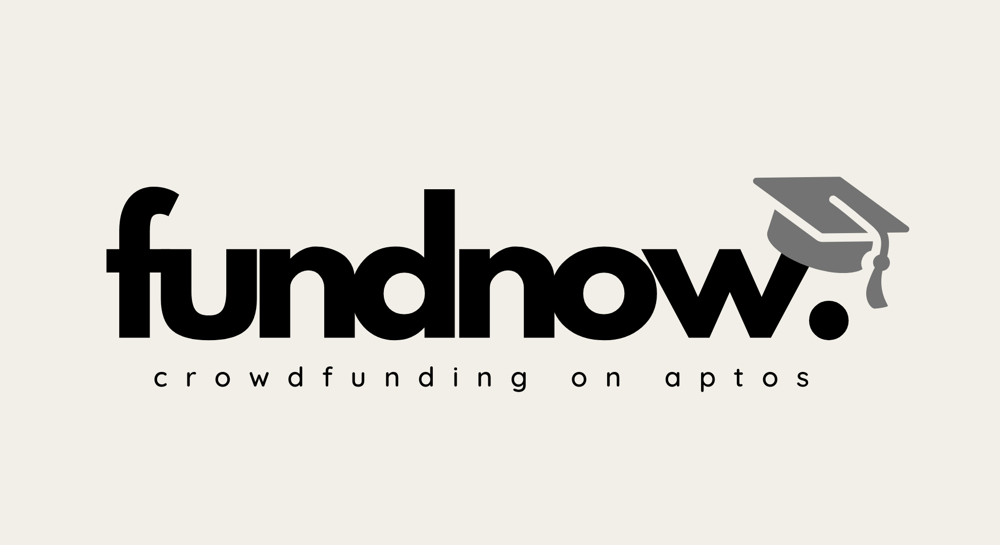

# FundNow - Decentralized Crowdfunding on Aptos

**FundNow** is a decentralized crowdfunding platform built on the Aptos blockchain. Our platform empowers students to raise funds transparently and securely for educational purposes. By leveraging blockchain technology, FundNow ensures trust, transparency, and inclusivity in the crowdfunding ecosystem.

## Vision

At FundNow, we believe in empowering individuals by removing financial barriers to education and innovation. Our platform allows anyone to create a campaign and raise funds from a global community of supporters in a decentralized, secure, and open environment.

## Features

- **Create Campaigns**: Users can create crowdfunding campaigns, including details such as name, description, goal amount, and category (e.g., Rising Scholars, Emerging Leaders, or Future Pioneers).
- **Contribute to Campaigns**: Contributors can support campaigns with AptosCoin through a transparent and secure blockchain system.
- **View Campaigns**: Campaign creators can view their campaigns, including the current funding progress.
- **Decentralized Crowdfunding**: FundNow operates on the Aptos blockchain, ensuring full transparency and security in all transactions.

## Smart Contract Information

Our crowdfunding platform is built using the Move programming language on the Aptos blockchain. The smart contract includes the following key components:

### Campaign Structure
```move
struct Campaign has store, key {
    name: vector<u8>,            // Campaign name
    creator: address,            // Campaign creator address
    description: vector<u8>,     // Campaign description
    goal_amount: u64,            // Goal amount for the campaign
    current_amount: u64,         // Current amount raised
    active: bool,                // Campaign active status
    category: u8,                // Campaign category (1: Rising Scholars, 2: Emerging Leaders, 3: Future Pioneers)
}
```
## Installation and Setup

This project uses basic HTML and JavaScript to make API calls to the Aptos network. To get started, simply clone the repository and run it on a local server.

### Steps:

1. **Clone the repository**:
    ```bash
    git clone https://github.com/your-username/fundnow.git
    ```

2. **Run the project on a local server**:
   Since this project is built with basic HTML and JavaScript, you can use any local server to run it. Here are two common methods:

   #### Option 1: Using VSCode Live Server
   - Open the project in Visual Studio Code.
   - Install the [Live Server extension](https://marketplace.visualstudio.com/items?itemName=ritwickdey.LiveServer).
   - Right-click on `index.html` and select **"Open with Live Server"**.

   #### Option 2: Using Python's HTTP server
   - If you have Python installed, navigate to the project folder and run the following command:
     ```bash
     python3 -m http.server
     ```
   - Open your browser and go to `http://localhost:8000` to view the project.

3. **Access the application**:
   Once the local server is running, open the provided local address in your browser (e.g., `http://localhost:8000`), and you will be able to interact with the FundNow application.

## Deployed on Vercel

You can access the live version of **FundNow** at:

[](https://fund-now.vercel.app)

Visit the live site here: [fund-now.vercel.app](https://fund-now.vercel.app)
----

### How to Use

- **Create a Campaign**: Use the form on the homepage to create a new campaign by providing the name, description, goal amount, and category.
- **Contribute to a Campaign**: Enter the campaign owner's address and the amount you'd like to contribute.
- **View Campaigns**: View the current campaigns to check their progress.

Demo
----

Check out a demo of **FundNow** on YouTube:

[FundNow Demo](https://youtu.be/I1E_giLwdOY)
----

### Contract Address:
0xa8b10ab4bf87b830aa1d6cc7c3e40825f28c0a8eb44ba3b1b2ce64e7fd79eaff
https://explorer.aptoslabs.com/account/0xa8b10ab4bf87b830aa1d6cc7c3e40825f28c0a8eb44ba3b1b2ce64e7fd79eaff/modules/code/CrowdFunding3?network=devnet

----
### Issues
There are some issues in the build which I am working on fixing.
--------------

-   **Only the Most Recent Campaign Can Be Contributed To**: Currently, only the most recent campaign created by a user is available for contributions.

-   **Campaign Visibility**: Only the campaign creator can view their own campaigns. We are working to implement a system where all campaigns are publicly viewable, regardless of the creator.

These issues are actively being addressed and will be fixed in future.
